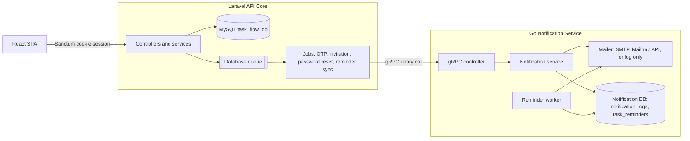
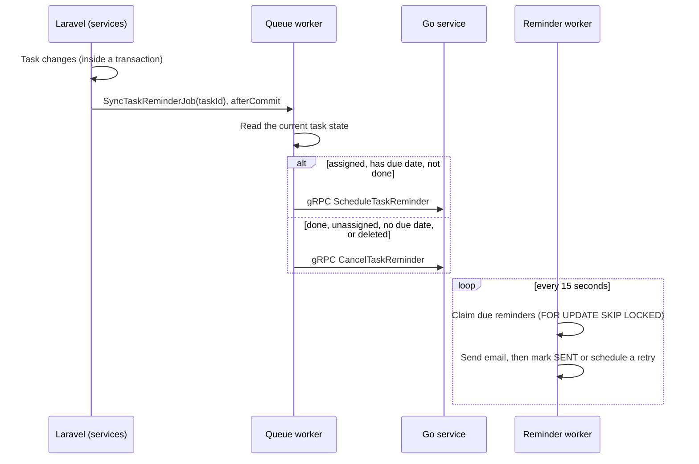
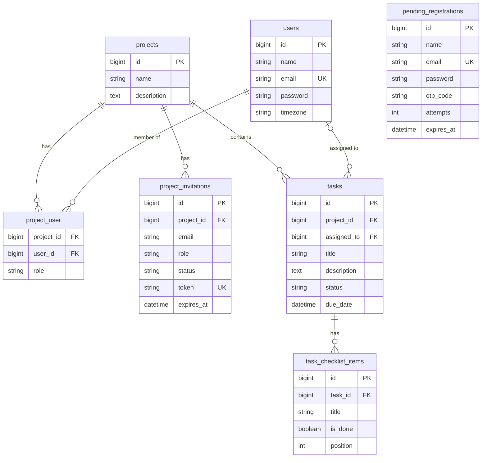
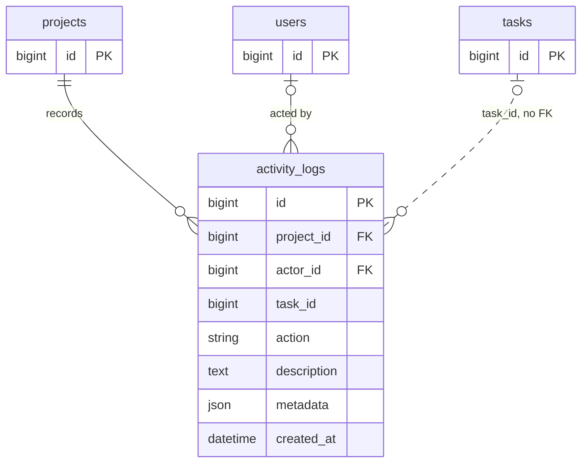
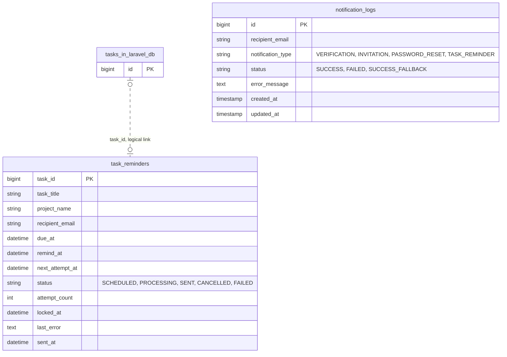
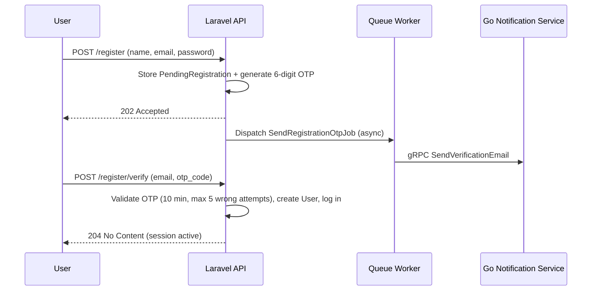

# TaskFlow

A multi-tenant project and task management app, built as a backend engineering portfolio project. The focus is not just CRUD, but a realistic **microservice architecture**: a Laravel API core talks to a Go notification service over **gRPC**, decoupled through an async queue, backed by row-level locking and an append-only audit log, with a React client on top.

## Features

- Registration with OTP email verification (verify-before-create), cookie-session login, and password reset
- Projects with **per-project roles** (owner / editor / viewer), member management, and email invitations
- Tasks with assignee, due date and status, plus an **optional checklist**: the status follows the checklist automatically, and progress is shown per task and per project
- **Due-date email reminders** scheduled and delivered by the Go service (24 hours before the due date)
- Append-only **activity log**: per-task history, an owner-only project timeline, and a personal **daily summary** grouped by project and task, in your own timezone
- Profile: name, timezone, and password change

## Tech Stack

| Layer | Technology |
|---|---|
| Core API | Laravel 13 (PHP 8.4), MySQL |
| Notification service | Go, gRPC, SMTP (Mailtrap Email Sandbox in development) |
| Inter-service contract | Protocol Buffers, managed with Buf |
| Auth | Laravel Sanctum (SPA cookie session), custom OTP email verification |
| Frontend | React 19, Vite, TypeScript, TanStack Query, Tailwind CSS 4 |
| Tests | Pest (Laravel), Go `testing`, Vitest (frontend) |
| Infrastructure | Docker Compose (multi-file, `include`-based) |

## Architecture

Email delivery is intentionally handled by a **separate Go service** instead of Laravel's built-in mailer. The Laravel API never blocks on email: it dispatches a queued job (always `afterCommit()`, so a job never runs for a transaction that rolled back), and the job makes a unary gRPC call to the Go service. The Go service owns its own database (`notification_logs`, `task_reminders`) and its own mail provider integration, independent of the core application.



### Reminder flow

The Go service **owns the reminder schedule**. Laravel only tells it the current truth about a task, and `SyncTaskReminderJob` makes that idempotent: it reads the task as it is *now* and either schedules or cancels.



- The reminder is due **24 hours before** the due date; if less than 24 hours remain, it is sent as soon as possible. A due date in the past cancels the reminder.
- The worker polls every 15 seconds, claims batches of 25 with `FOR UPDATE SKIP LOCKED` (so several instances never double-send), and recovers reminders stuck in `PROCESSING` for more than 5 minutes.
- Failed deliveries retry with a linear backoff (attempt × 5 minutes) and end as `FAILED` after 5 attempts.
- Triggers: creating, updating, or deleting a task, a status change driven by its checklist, removing a member (their tasks are unassigned), and deleting a project.

## gRPC Contract

Defined in [`proto/notification/v1/notification.proto`](proto/notification/v1/notification.proto).

| RPC | Triggered by | Notes |
|---|---|---|
| `SendVerificationEmail` | Registration | OTP code |
| `SendInvitationEmail` | Project invitation | Carries `accept_url`; the token is built into the link by Laravel and never sent as a separate field |
| `SendPasswordResetEmail` | Forgot password | Carries the complete `reset_url` built by Laravel |
| `ScheduleTaskReminder` | Task create / update | `due_date` is RFC 3339 and must be UTC |
| `CancelTaskReminder` | Task done, unassigned, or deleted | Idempotent |

Operational failures (invalid input, mail provider down) come back as `success: false` with a message, not as gRPC errors. The Laravel client turns both a non-OK status and `success: false` into an exception, so the queued job retries.

## Data Model

TaskFlow uses two MySQL databases: the Laravel API's own, and a separate one owned by the Go notification service. They share no foreign keys: the only link is a logical `task_id`.

### Core database (Laravel)



`project_user` is unique on (`project_id`, `user_id`). Deleting a project cascades to its members, invitations, and tasks; deleting a task cascades to its checklist items. `pending_registrations` has no relations: it holds a sign-up until its OTP is confirmed, and only then is the `users` row created.

### Audit log (Laravel)



`activity_logs` is append-only and feeds the task history, the owner-only project timeline, and the daily summary. `task_id` deliberately has **no foreign key**, so the history of a deleted task survives. `metadata` stores snapshots (task title, member name, invited email), so entries stay readable after the original rows change or disappear. If a user is deleted, `actor_id` becomes `NULL`; if a project is deleted, its log goes with it.

### Notification service database (Go)



`task_reminders` is keyed by the Laravel task's ID, but that is a logical reference across databases, so there is no foreign key. The service stores the title, project name, and recipient email it needs, and never reads the Laravel database. `notification_logs` records every delivery attempt on its own, with no relations.

## Authentication

Sessions are **Sanctum SPA cookie sessions**, not Bearer tokens.

### Verify-before-create registration

Instead of the default Laravel pattern (create the user, send a verification link, block access until verified), no `User` row exists until the OTP is confirmed. This avoids unverified "zombie" accounts in the `users` table entirely.



### Password reset

`POST /forgot-password` **always answers 200** with a neutral message, so it never reveals whether an email is registered. The token is created and validated by Laravel's password broker; the email is sent through the Go service, linking to `FRONTEND_URL/password-reset/{token}?email=...`. A wrong, expired, or reused token returns `422` on `reset-password`. Both endpoints are throttled.

## Access Control

Roles are scoped **per project** (`project_user.role`), not globally: a user can be `owner` on one project and `viewer` on another. Any authenticated user can create a project and becomes its `owner`.

### Role permission matrix

| Capability | Owner | Editor | Viewer |
|---|:---:|:---:|:---:|
| Edit / delete project | ✅ | ❌ | ❌ |
| Change a member's role | ✅ | ❌ | ❌ |
| Create / list / revoke invitations | ✅ | ❌ | ❌ |
| Remove another member | ✅ | ❌ | ❌ |
| View the project activity timeline | ✅ | ❌ | ❌ |
| Create tasks | ✅ | ✅ | ❌ |
| Edit task fields (title, description, due date, assignee) | ✅ | ✅ | ❌ |
| Delete tasks | ✅ | ✅ | ❌ |
| Change task status | ✅ any task | ✅ any task | ✅ own assigned task only |
| Add / rename / delete checklist items | ✅ | ✅ | ❌ |
| Check / uncheck checklist items | ✅ any task | ✅ any task | ✅ own assigned task only |
| Leave the project (remove self) | ✅ | ✅ | ✅ |
| View project, members, tasks, and task history | ✅ | ✅ | ✅ |

### Business rules

- A project must always keep **at least one owner**: the last owner cannot be demoted, removed, or leave (422).
- A task's assignee must be a **member of the same project** (422 on `assigned_to`).
- When a member is removed or leaves, their tasks are **automatically unassigned** and the change is logged.
- Invitations expire after **7 days**, only one pending invitation can exist per email, and existing members cannot be invited. An expired invitation keeps the status `pending` and is told apart by `expires_at`.
- **Progress**: a task's progress is 100 when its status is `done`, otherwise `checked items / total items` (0 without a checklist). A project's progress is the average of its tasks' progress.
- **Status follows the checklist**: checking the first item moves a `todo` task to `in_progress`; checking every item marks it `done`; unchecking an item (or adding a new one) on a `done` task reopens it as `in_progress`. Status can still be set manually: a manual `done` makes progress 100 regardless of the checklist. A task holds at most 50 checklist items.
- The activity log is **append-only** and records only real changes: an update that changes nothing logs nothing. History survives task deletion.
- Non-members get `403` on existing resources; unknown IDs get `404`.

## Accessing the API

- Base URLs: `http://localhost:8000` (auth endpoints) and `http://localhost:8000/api` (everything else).
- Every request: `Accept: application/json`, and send cookies. The `Origin` / `Referer` must match `SANCTUM_STATEFUL_DOMAINS` (the defaults include `localhost:3000`), otherwise no session is started.
- **CSRF**: call `GET /sanctum/csrf-cookie` first, then send the `XSRF-TOKEN` cookie value (URL-decoded) as the `X-XSRF-TOKEN` header on every mutating request. The token **changes after register-verify, login, and logout**, so refresh it afterwards. A `419` means the token is stale: fetch a new cookie and retry once.
- Success responses are `{ "success": true, "message": "...", "data": ... }`. Lists return `data: { items, meta: { current_page, per_page, total } }`, with `per_page` between 1 and 100 (default 15). Validation errors are `422 { "success": false, "message": "...", "errors": { field: [...] } }`. `204` responses have no body. Datetimes are ISO 8601 in UTC.

### Endpoint overview

| Area | Endpoints (`/api` prefix unless noted) |
|---|---|
| Auth (no prefix) | `GET /sanctum/csrf-cookie`, `POST /register`, `POST /register/verify`, `POST /login`, `POST /logout`, `POST /forgot-password`, `POST /reset-password` |
| Account | `GET /user`, `PATCH /profile`, `PUT /profile/password` |
| Projects | `GET/POST /projects`, `GET/PATCH/DELETE /projects/{id}` (list filter: `name`) |
| Members | `GET /projects/{id}/members` (filter: `name`), `PATCH/DELETE /projects/{id}/members/{user}` |
| Invitations (owner) | `GET/POST /projects/{id}/invitations` (filter: `status`), `DELETE /projects/{id}/invitations/{invitation}` |
| Invitations (invitee) | `GET /invitations/{token}` (public preview), `GET /invitations`, `POST /invitations/{token}/accept`, `POST /invitations/{token}/decline` |
| Tasks | `GET/POST /projects/{id}/tasks` (filters: `title`, `status`, `mine=1`), `GET/PATCH/DELETE /tasks/{id}` |
| Checklist | `POST /tasks/{id}/checklist-items`, `PATCH/DELETE /checklist-items/{item}` |
| Activity | `GET /tasks/{id}/activities`, `GET /projects/{id}/activities` (owner only; filters: `action`, `actor_id`, `task_id`) |
| Daily summary | `GET /me/daily-summary` (`from`, `to`; up to 31 days) |

Full endpoint documentation (request / response examples, validation rules, error responses) is maintained in Apidog:

📄 **[Apidog documentation](https://ygst4z3h51.apidog.io)**

## Local Development

Requires Docker Desktop and a local **MySQL 8.0.1 or newer** (the reminder worker relies on `SKIP LOCKED`) with two databases: `task_flow_db` (Laravel) and `taskflow_notification_db` (Go service). Containers reach MySQL through `host.docker.internal`.

```bash
# 1. One-time: shared network
docker network create taskflow

# 2. Environment files
cp laravel-api-core/.env.example laravel-api-core/.env
cp go-notification-service/.env.example go-notification-service/.env
# fill in DB credentials and the mail provider settings (see below)

# 3. Start everything
docker compose up -d --build

# 4. First run only, if APP_KEY is empty
docker exec -it taskflow-laravel php artisan key:generate
```

| Container | Role | Port |
|---|---|---|
| `taskflow-laravel` | REST API (runs migrations on startup) | 8000 |
| `taskflow-queue` | Queue worker (OTP, invitation, password reset, and reminder jobs) | n/a |
| `taskflow-notification` | Go gRPC notification service (also runs its own migrations) | 50051 |
| `taskflow-web` | React SPA (production build served by nginx) | 3000 |

**Mail provider** (`go-notification-service/.env`): `MAIL_PROVIDER` selects how emails leave the Go service.

| Value | Behaviour |
|---|---|
| empty | Emails are only written to the log (status `SUCCESS_FALLBACK`) |
| `smtp` | Real SMTP with STARTTLS. For development, use a Mailtrap Email Sandbox inbox: `SMTP_HOST=sandbox.smtp.mailtrap.io`, `SMTP_PORT=2525` (credentials from the Integration tab) |
| `mailtrap` | Mailtrap API (`MAILTRAP_API_TOKEN`) |

An unknown provider, or missing variables for the chosen provider, makes the service **fail at startup** instead of failing silently on the first email. Laravel's own `MAIL_MAILER` is not used by any flow.

Notes:
- `FRONTEND_URL` in `laravel-api-core/.env` must not be empty: an empty value overrides the default and breaks the links in emails.
- Without `taskflow-queue` running, no emails are sent and no reminders are synced.
- The queue worker is long-running: after changing PHP job code, run `docker restart taskflow-queue`. Go code is not mounted: after changing it, run `docker compose up -d --build go-notification-service` (and `--force-recreate` after editing its `.env`).
- `taskflow-web` and `pnpm dev` (in `react-web-client`) both use port 3000. For hot reload, stop the container and run `pnpm dev`.
- Edited migrations are not re-run automatically. Reset with `docker exec -it taskflow-laravel php artisan migrate:fresh` (deletes development data; stop `taskflow-queue` first, otherwise the `jobs` table can stay locked).
- Requests to Laravel through Docker Desktop on Windows feel slow because of bind-mount I/O on `vendor`; this is not a code issue.

## Testing

```bash
# Laravel API (Pest, in-memory SQLite, no MySQL needed)
docker exec -it taskflow-laravel php artisan test

# Go notification service
cd go-notification-service && go test ./... -cover

# Frontend
cd react-web-client && pnpm test
```

- **Laravel**: feature tests cover every endpoint, the permission matrix, validation, and the business rules above. The gRPC client is mocked, and SQLite ignores `lockForUpdate`, so these tests verify the logic but **not** the locking or a real gRPC connection.
- **Go**: unit tests with fake repository and mailer cover the controller (100%) and the service (99%): input validation, the 24-hour schedule, backoff, batching, and worker shutdown. The mailer package covers message building (including header-injection rejection), configuration, and the factory (28%). The SMTP conversation itself, the Mailtrap provider, and the MySQL repository (`SKIP LOCKED`, recovery of stuck reminders) are **not** covered; they need a real SMTP server and MySQL (planned as integration tests).
- **Frontend**: Vitest covers the pure logic (permissions, form schemas, redirect validation, date-range rules).

## Engineering Notes

- **Layering**: route → `can:` policy middleware → Form Request → thin controller → service (business logic and transaction) → model. No repository layer on top of Eloquent.
- **Transactions live in services**, and any job dispatched inside one uses `afterCommit()`. No slow network call happens inside a transaction or lock.
- **Locking is targeted**: `lockForUpdate` is used only for read-check-write sequences that two concurrent requests could break (last owner, duplicate invitations, task status recomputation), always inside a transaction and always **project first, then other rows** to avoid deadlocks.
- **Jobs build their URLs at run time** (`handle()`), from `config('app.frontend_url')`, so queued payloads stay valid if the frontend URL changes.
- **One audit log** (`activity_logs`) feeds the task history, the project timeline, and the daily summary. Events are written inside the same transaction as the change they describe.

## Known Limitations

- The gRPC service has **no authentication**. Port 50051 is published to the host for development only; in production it should be reachable only inside the Docker network.
- OTPs, invitation tokens, and password reset tokens sit in plain text in the `jobs` / `failed_jobs` payloads until processed or removed.
- `POST /register` still reveals whether an email is registered (unique validation, 422), so enumeration protection is partial; `forgot-password` is fully neutral.
- Changing the password does not revoke sessions on other devices. Changing the email address and profile photos are not implemented.
- `APP_DEBUG=true` and the cookie settings are for development. See the checklist below before deploying.

### Before deploying

HTTPS with secure cookies; `SESSION_DOMAIN`, `SANCTUM_STATEFUL_DOMAINS`, and CORS set for the production domains; production `FRONTEND_URL`; `APP_DEBUG=false`; the queue worker under a process supervisor; MySQL 8.0.1 or newer; port 50051 not published to the host; and a check that local files such as SQLite databases are not committed.

## Project Structure

```
TaskFlow/
├── laravel-api-core/        # Main REST API (Laravel 13)
├── go-notification-service/ # Email delivery and reminder scheduling (Go + gRPC)
├── proto/                   # Shared gRPC contract (Protocol Buffers, managed with Buf)
├── react-web-client/        # Frontend (React SPA)
└── docker-compose.yml       # Root compose file, includes each service's own compose file
```

Each service has its own README with details: [`laravel-api-core`](laravel-api-core/README.md), [`go-notification-service`](go-notification-service/README.md), [`react-web-client`](react-web-client/README.md).

To regenerate the gRPC stubs for both languages after editing the proto file: `cd proto && buf generate`.