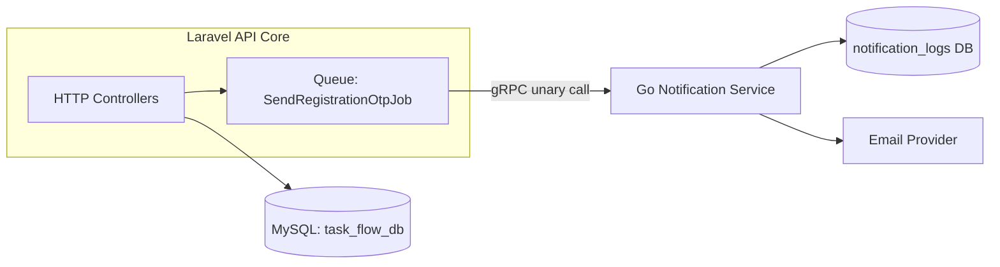
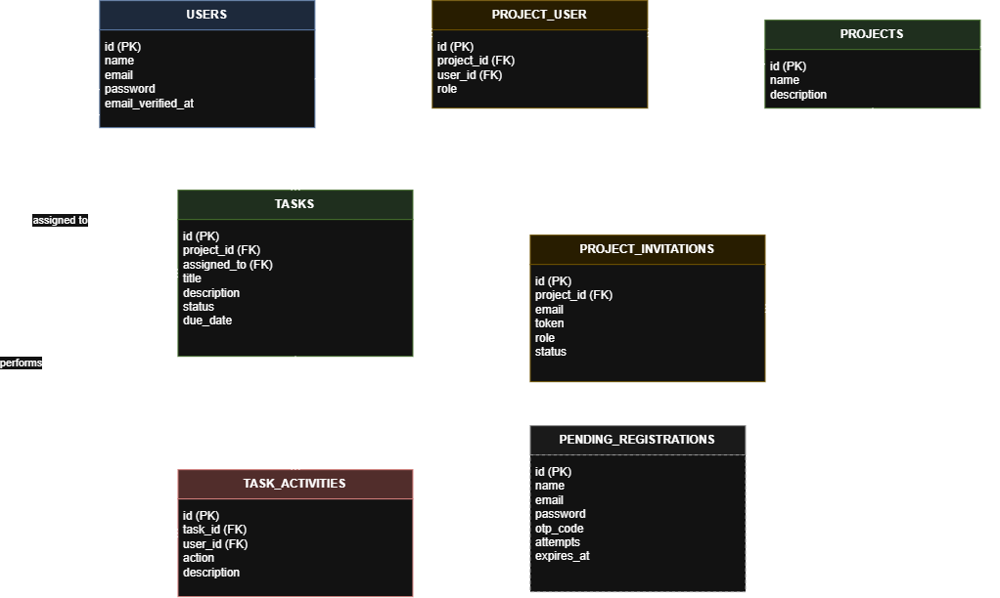
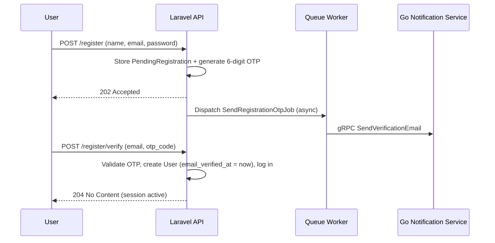

# TaskFlow

A multi-tenant project & task management API, built as a backend engineering portfolio project. The focus of this project is not just CRUD, but demonstrating a realistic **microservice architecture**: a Laravel API core communicating with a Go notification service over **gRPC**, decoupled through an async queue.

## Tech Stack

| Layer | Technology |
|---|---|
| Core API | Laravel 13 (PHP 8.4), MySQL |
| Notification Service | Go, gRPC, Mailtrap API |
| Inter-service contract | Protocol Buffers (Buf) |
| Auth | Laravel Sanctum (SPA session-based), custom OTP email verification |
| Infrastructure | Docker Compose (multi-file, `include`-based) |

## Architecture

Email delivery is intentionally handled by a **separate Go service** rather than Laravel's built-in mailer, communicating over gRPC. This is a deliberate architectural choice to demonstrate service decoupling: the Laravel API never blocks on email delivery — it dispatches a queued job, which calls the Go service via a unary gRPC call. The Go service owns its own database (`notification_logs`) and its own email provider integration, independent of the core application's database and codebase.



## Notification Service Contract

| RPC | Trigger |
|---|---|
| `SendVerificationEmail` | User registration (OTP) |
| `SendInvitationEmail` | Project member invitation |
| `ScheduleTaskReminder` | Task due date approaching |

## Entity Relationship Diagram



## Authentication Flow: Verify-Before-Create Registration

Rather than the default Laravel pattern (create user → send verification link → block access until verified), this project uses a **verify-before-create** pattern: no `User` row is created until the OTP is confirmed. This avoids unverified "zombie" accounts in the `users` table entirely.



## Access Control

Roles are scoped **per project** (stored on `project_user.role`), not globally: a user can be `owner` on one project and `viewer` on another. Any authenticated user can create a project and automatically becomes its `owner`.

### Role Permission Matrix

| Capability | Owner | Editor | Viewer |
|---|:---:|:---:|:---:|
| Edit / delete project | ✅ | ❌ | ❌ |
| Change a member's role | ✅ | ❌ | ❌ |
| Create / list / revoke invitations | ✅ | ❌ | ❌ |
| Remove another member | ✅ | ❌ | ❌ |
| Create tasks | ✅ | ✅ | ❌ |
| Edit task fields (title, description, due date, assignee) | ✅ | ✅ | ❌ |
| Delete tasks | ✅ | ✅ | ❌ |
| Change task status | ✅ any task | ✅ any task | ✅ Own assigned task only |
| Leave the project (remove self) | ✅ | ✅ | ✅ |
| View project, members, tasks & activity log | ✅ | ✅ | ✅ |

### Business Rules

- A project must always keep **at least one owner**: the last owner cannot be demoted, removed, or leave (422).
- A task's assignee must be a **member of the same project** (422 on `assigned_to`).
- When a member is removed or leaves, their tasks are **automatically unassigned** and the change is logged.
- Invitations expire after **7 days**, only one pending invitation can exist per email, and existing members cannot be invited.
- The activity log is **read-only** and records only real changes (`created`, `status_changed`, `assigned`, `updated`). An update that changes nothing logs nothing.
- Non-members get `403` on existing resources; unknown IDs get `404`.

## Accessing the API

Authentication uses **Sanctum SPA cookie sessions**, not Bearer tokens.

- Base URL: `http://localhost:8000` (auth endpoints) and `http://localhost:8000/api` (everything else).
- Every request: `Accept: application/json`, and send cookies.
- The `Origin`/`Referer` must match `SANCTUM_STATEFUL_DOMAINS` (defaults include `localhost:3000`), otherwise the session is not started.


## API Documentation

Full endpoint documentation (request/response examples, validation rules, error responses) is maintained in Apidog:

📄 **[API Documentation — link here](https://ygst4z3h51.apidog.io)**

## Local Development

Requires Docker Desktop and a local MySQL instance with two databases: `task_flow_db` (Laravel) and `taskflow_notification_db` (Go service). Containers reach MySQL through `host.docker.internal`.

```bash
# 1. One-time: shared network
docker network create taskflow

# 2. Environment files
cp laravel-api-core/.env.example laravel-api-core/.env
cp go-notification-service/.env.example go-notification-service/.env
# fill in DB credentials and the mail provider settings

# 3. Start everything
docker compose up -d --build

# 4. First run only, if APP_KEY is empty
docker exec -it taskflow-laravel php artisan key:generate
```

| Container | Role | Port |
|---|---|---|
| `taskflow-laravel` | REST API (runs migrations on startup) | 8000 |
| `taskflow-queue` | Queue worker (sends OTP / invitation emails via gRPC) | n/a |
| `taskflow-notification` | Go gRPC notification service | 50051 |

Notes:
- Without `taskflow-queue` running, OTP and invitation emails are never sent.
- The queue worker is long-running: after changing PHP code, run `docker restart taskflow-queue`.
- Edited migrations are not re-run automatically. Reset with `docker exec -it taskflow-laravel php artisan migrate:fresh`.

## Running Tests

```bash
docker exec -it taskflow-laravel php artisan test
```

Tests use Pest with an in-memory SQLite database, so MySQL is not required. Row locking (`lockForUpdate`) is ignored by SQLite, so the tests verify the business logic but not the locking itself.

## Project Structure

```
TaskFlow/
├── laravel-api-core/        # Main REST API (Laravel 13)
├── go-notification-service/ # Email delivery microservice (Go + gRPC)
├── proto/                   # Shared gRPC contract (Protocol Buffers, managed via Buf)
├── react-web-client/        # Frontend (SPA)
├── docs/                    # ERD diagram
└── docker-compose.yml       # Root compose file, includes each service's own compose file
```
