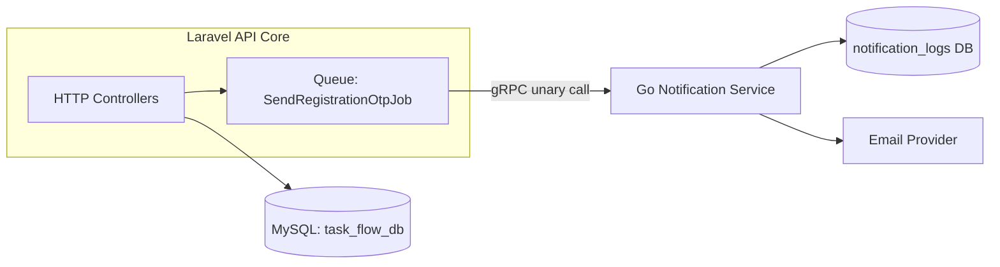
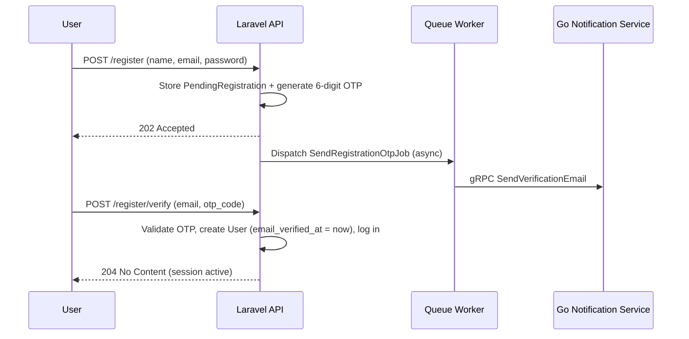

# TaskFlow

A multi-tenant project & task management API, built as a backend engineering portfolio project. The focus of this project is not just CRUD, but demonstrating a realistic **microservice architecture**: a Laravel API core communicating with a Go notification service over **gRPC**, decoupled through an async queue.

## Tech Stack

| Layer | Technology |
|---|---|
| Core API | Laravel 13 (PHP 8.4), MySQL |
| Notification Service | Go, gRPC, Mailtrap API |
| Inter-service contract | Protocol Buffers (Buf) |
| Auth | Laravel Sanctum (SPA session-based), custom OTP email verification |
| Infrastructure | Docker Compose (multi-file, `include`-based) |

## Architecture

Email delivery is intentionally handled by a **separate Go service** rather than Laravel's built-in mailer, communicating over gRPC. This is a deliberate architectural choice to demonstrate service decoupling: the Laravel API never blocks on email delivery — it dispatches a queued job, which calls the Go service via a unary gRPC call. The Go service owns its own database (`notification_logs`) and its own email provider integration, independent of the core application's database and codebase.



## Notification Service Contract

| RPC | Trigger |
|---|---|
| `SendVerificationEmail` | User registration (OTP) |
| `SendInvitationEmail` | Project member invitation |
| `ScheduleTaskReminder` | Task due date approaching |

## Entity Relationship Diagram


## Authentication Flow: Verify-Before-Create Registration

Rather than the default Laravel pattern (create user → send verification link → block access until verified), this project uses a **verify-before-create** pattern: no `User` row is created until the OTP is confirmed. This avoids unverified "zombie" accounts in the `users` table entirely.



## Role Permission Matrix

Roles are scoped **per project** (stored on `project_user.role`), not globally — a user can be `owner` on one project and `viewer` on another.

| Action | Owner | Editor | Viewer |
|---|:---:|:---:|:---:|
| Edit / delete project | ✅ | ❌ | ❌ |
| Invite / remove members | ✅ | ❌ | ❌ |
| Create / edit / delete tasks | ✅ | ✅ | ❌ |
| Update status of own assigned task | ✅ | ✅ | ✅ |
| View tasks & activity log | ✅ | ✅ | ✅ |

## API Documentation

Full endpoint documentation (request/response examples, validation rules, error responses) is maintained in Apidog:

📄 **[API Documentation — link here](https://ygst4z3h51.apidog.io)**

## Local Development

Requires Docker Desktop and a local MySQL instance (two separate databases: `task_flow_db` for Laravel, `taskflow_notification_db` for the Go service).

```bash
docker network create taskflow
docker compose up -d --build
```

Both services run their own migrations automatically on startup. Laravel is served at `http://localhost:8000`, the Go gRPC service listens on `:50051`.

## Project Structure

```
TaskFlow/
├── laravel-api-core/        # Main REST API (Laravel 13)
├── go-notification-service/ # Email delivery microservice (Go + gRPC)
├── proto/                   # Shared gRPC contract (Protocol Buffers, managed via Buf)
├── react-web-client/        # Frontend (SPA)
├── docs/                    # ERD source (draw.io) and exported diagrams
└── docker-compose.yml       # Root compose file, includes each service's own compose file
```
